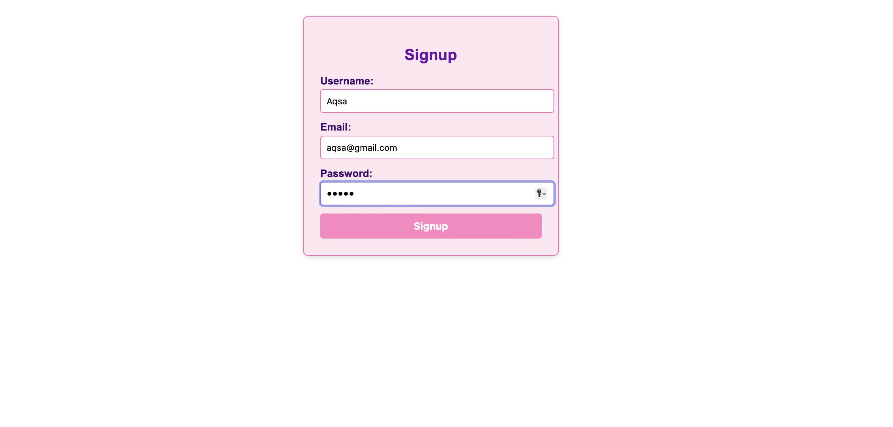
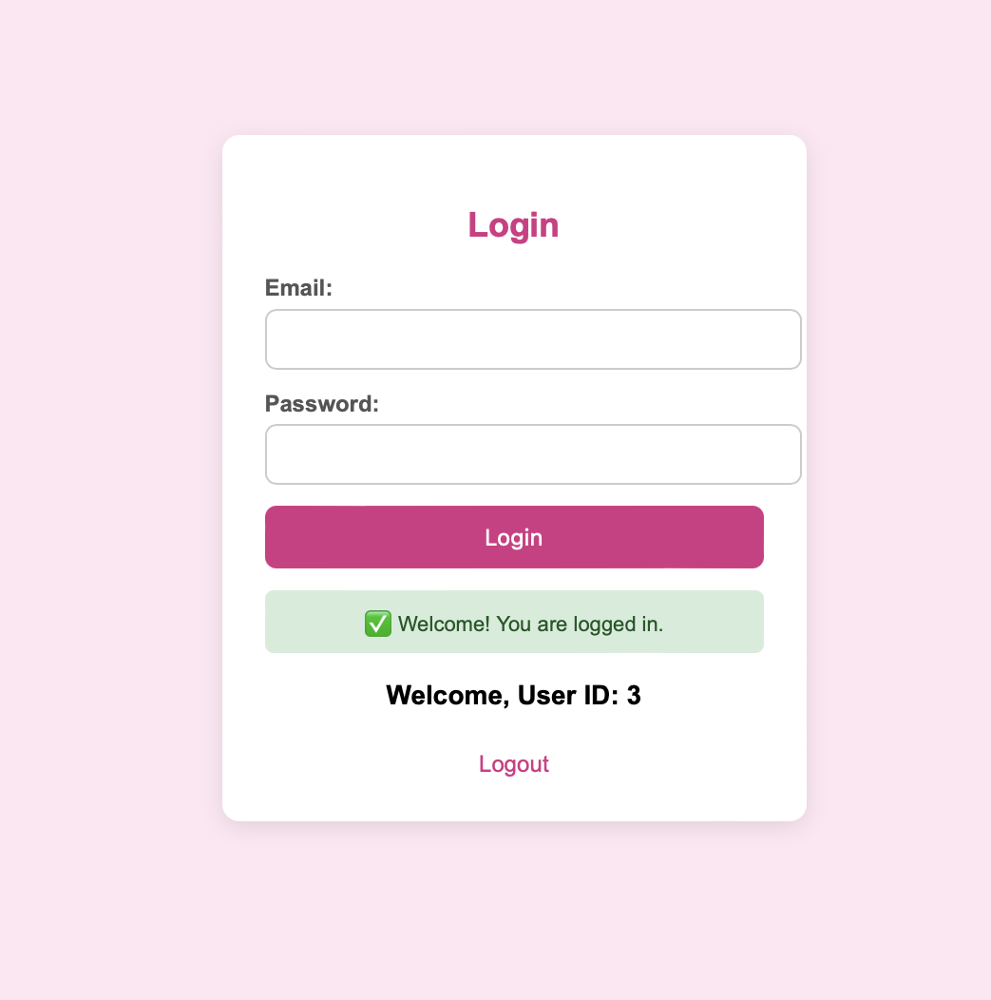
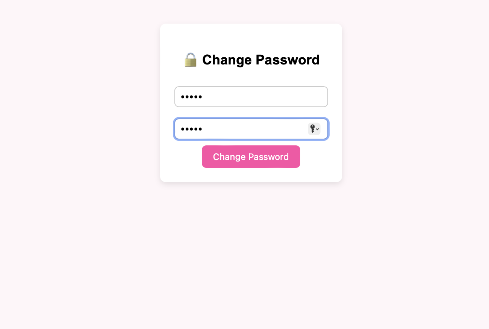
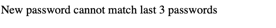
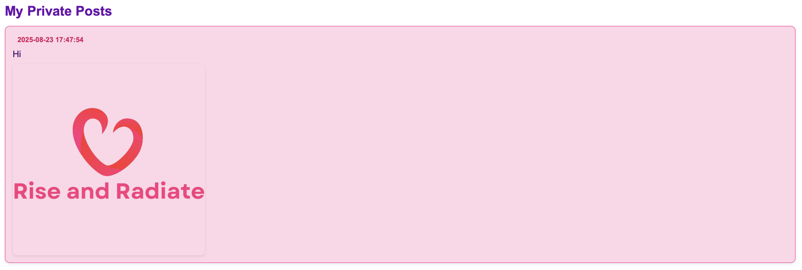
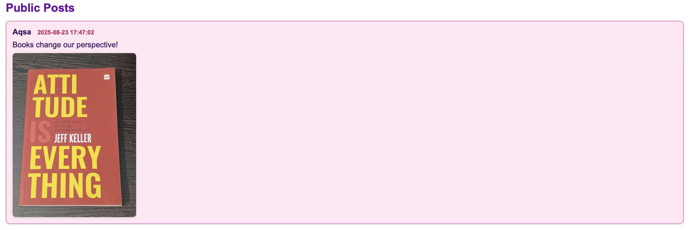

This project is a PHP-based web application developed as part of the Nutz Interview Round One task.
The application provides a secure platform where users can:
Sign Up / Log In with unique credentials (username, email, password).
Change Password, ensuring that the new password is not one of the last three previously used.
Post Messages in text format with visibility options:
Public Posts – visible to all users.
Private Posts – visible only to the creator.
All user data, including passwords and posts, is stored securely in the database. The application is designed with security and scalability in mind, similar to core features of social media platforms.

